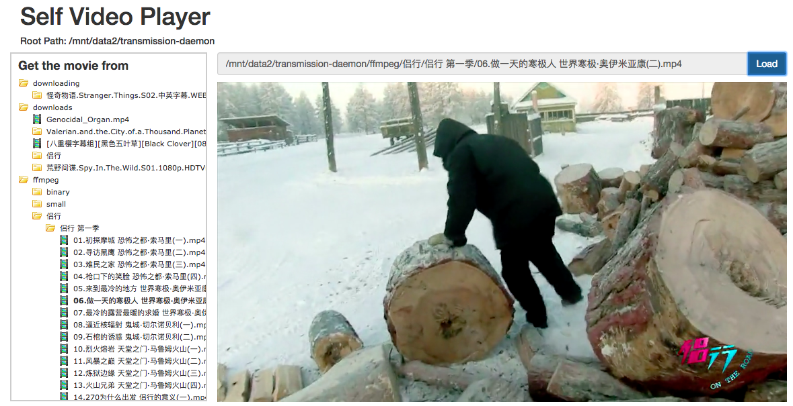

## RV\_Player

Simple page for view remote server videos. 

### Start server

1. Use mongodb as session storage.

        mkdir -p data; mongo --dbpath ./data
        
2. Set the configuration, in `web/config/default.js`.

         'use strict';

         module.exports = {
           dirRoot: '<set as the remote server video path>',
           debug: false,
           url: 'mongodb://localhost:27017/rv_play',
           session: {
             name: 'SID',
             secret: 'SID',
             cookie: {
               httpOnly: true,
               secure: false,
               maxAge: 30 * 24 * 60 * 60 * 1000,
             }
           },
           allowExts: ['mp4'],
         }

3. Start the web service

        PORT=8080 web/bin/www 0.0.0.0

### Demo Page

